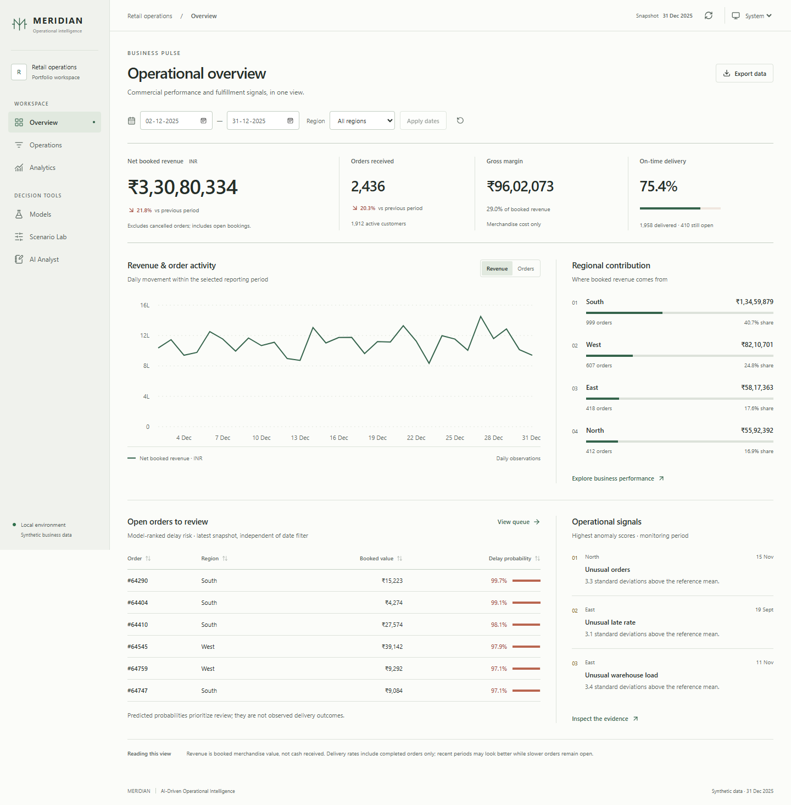
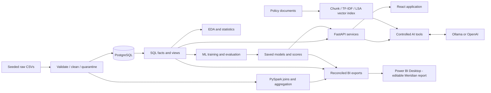
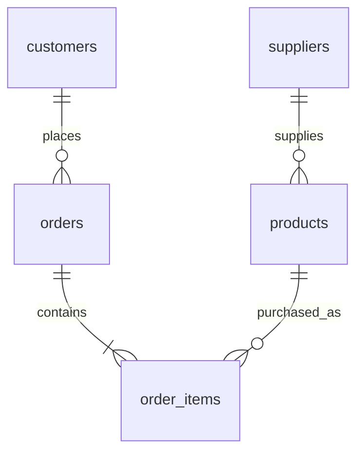
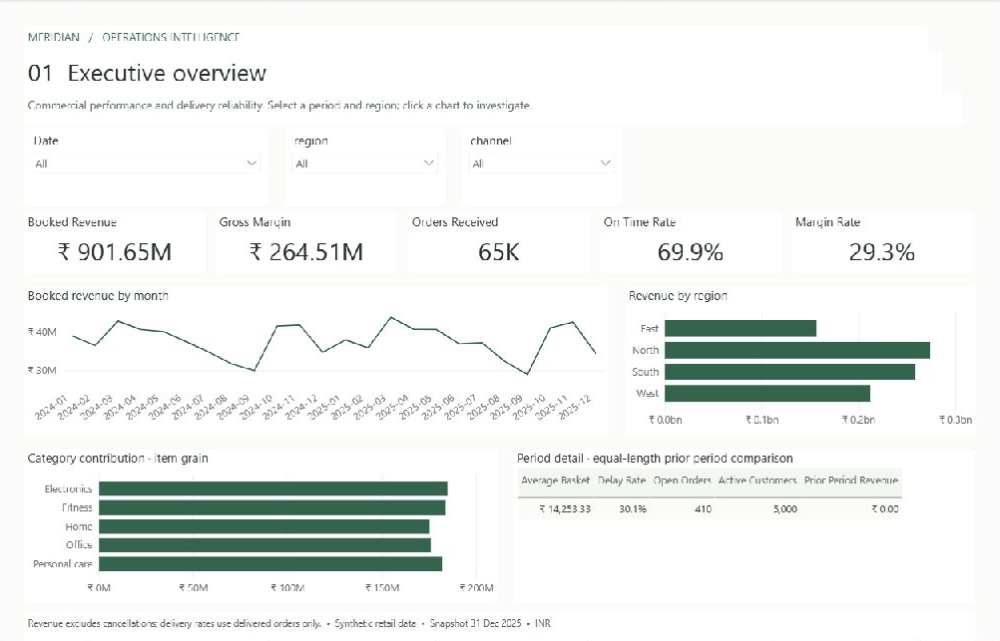

# Meridian — AI-Driven Operational Intelligence

A locally runnable retail fulfillment product connecting **PostgreSQL → Python ETL → statistics → ML → React analytics → a tool-using AI analyst**. It answers what changed, where to investigate, which open orders are at risk, and what demand may look like next.

**All business records are synthetic.** The snapshot ends on **31 December 2025**, currency **INR**. No Git commits, remote repositories, GitHub Actions, or cloud deployments are needed.

## Project Overview

Meridian is a single-business internal analytics application. Its database, pipeline, models, API, UI and analyst share the same underlying operational data. It includes reproducible raw-data defects, a quarantine audit, analytical SQL, tested inference, genuine local LLM tool calling, local vector retrieval and a populated six-page Power BI report.



**Verified locally on Windows, 27 September 2026:** 35 Python tests, 3 frontend unit tests, 8 final browser tests, 569 source reconciliation checks and 262 Power BI engine checks passed. The saved report reopened with its theme intact. A cold-start Ollama failure recovered on retry; numerical prose can be withheld by the evidence guard. See the [final handoff record](docs/handoff.md) for the precise scope and limitations.

## Business Problem

A regional retailer needs to understand revenue movements while maintaining delivery reliability. Revenue totals alone do not reveal whether changes came from order volume or average basket value, and a list of delayed deliveries arrives too late to prioritize open orders. Meridian connects commercial performance with fulfillment conditions and makes the evidence inspectable by managers.

## Key Features

- Filterable live revenue, order, margin and delivery KPIs backed by PostgreSQL.
- Exact monthly revenue decomposition into volume and basket effects by region.
- Delivery-risk predictions for open orders, held-out model metrics, permutation importance and a scenario lab.
- Four customer RFM segments, daily regional anomaly detection and a 14-day portfolio demand outlook.
- Statistical report with distributions, correlations, Wilson intervals and a daily-block-bootstrap analysis.
- AI analyst using local Ollama or optional OpenAI Responses API, bounded read-only tools, evidence cards, cited policy retrieval, numeric/citation checks and one correction attempt.
- Honest data-only evidence mode when no model provider is configured.
- CSV exports, a populated six-page Power BI report with 49 DAX measures, 14 relationships and a persisted Meridian theme, plus a separate Spark workflow with SQL reconciliation. See [Power BI verification](docs/power-bi-verification.md).
- Local error handling, integration tests, real browser tests, Docker alternatives and Windows helper scripts.
- An editorial frontend with persisted Light/Dark/System themes, dedicated operations and scenario workspaces, sortable analytical tables, and an AI evidence notebook. See [frontend design and verification](docs/frontend-redesign.md).

## Architecture



One FastAPI application, one relational database, one React client, and offline pipeline commands. No queues, microservices or unnecessary cloud dependencies.

## Technology Stack

| Technology | Actual purpose and selection rationale |
|---|---|
| Python 3.12, Pandas, NumPy | Reproducible generation, explicit validation, analysis and feature preparation at a practical local scale. |
| PostgreSQL 17, SQLAlchemy, Psycopg | Enforced relationships, transactional ingestion, safe parameterized reads, analytical views/windows. |
| Scikit-learn | Composable train-only preprocessing, strong interpretable baselines, model selection, serialization and inference. |
| SciPy, Matplotlib | Statistical analysis and an exportable four-panel EDA figure. |
| FastAPI, Pydantic | Typed API contracts, bounded inputs, useful errors and interactive OpenAPI documentation. |
| React, Vite, Recharts | Responsive filterable product UI, actual charts and a model scenario interface. |
| PySpark 3.5 / Java 17 | Genuine relational scans, broadcast join, shuffle aggregation and a time-window transformation over enlarged data. |
| Ollama / OpenAI Responses | LLM-selected function calls and natural-language interpretation of actual evidence. Local Ollama avoids API-key requirements. |
| TF-IDF + truncated SVD / Joblib | Persisted local dense LSA vectors and cosine retrieval for a small operational knowledge base; no external embedding service. |
| Power BI | Six-page analytical report with typed imports, grain-safe relationships, explicit DAX and source reconciliation; the saved PBIX was reopened and tested in Desktop. |
| Pytest / Playwright | Transformation, SQL, inference, tool safety, API, browser and responsive-layout verification. |

## Data Flow

1. `pipeline.generate` creates approximately 65,000 orders and 162,600 order lines, 5,000 customers, 120 products and 12 suppliers, with seasonality, congestion and supplier effects.
2. `pipeline.clean` normalizes types/categories, preserves valid outliers, audits missing values and quarantines invalid rows with reasons.
3. `pipeline.run` applies SQL DDL and reloads the five business tables in a single transaction. Raw fingerprints and a successful-run manifest are retained.
4. SQL views build order-level and daily regional facts; Python produces EDA, statistics, labels and order-time features.
5. Training compares candidates on chronological validation data, evaluates the held-out test, saves models and materializes scored output.
6. FastAPI serves live SQL metrics and saved ML artifacts. React calls `/api`; AI accesses the same domain services through a strict tool registry.
7. Power BI exports and a separate PySpark workflow share the curated source and reconcile aggregate totals.

## Project Structure

```text
backend/app/     FastAPI routes, services and data access
frontend/        React application and browser verification
pipeline/        Synthetic generator, cleaning and transactional loading
database/        PostgreSQL schema, views and analytical queries
analytics/       EDA and statistical analysis
ml/              Training, evaluation and saved-model inference
ai/              Controlled analyst tools, retrieval and policy documents
spark_jobs/      Real PySpark processing workflow
powerbi/         Editable report/model source, DAX and reconciliation utilities
scripts/         Bootstrap, exports, verification and Windows lifecycle helpers
tests/           Python unit and integration tests
docs/            Model card, report guide, demo and publishable screenshots
data/            Generated raw, curated and export files (local, ignored)
artifacts/       Generated models and retrieval index (local, ignored)
reports/         Generated analysis and execution evidence (local, ignored)
```

## Database Schema



`database/schema.sql` defines primary/foreign keys, price/quantity/range/status constraints and join/filter indexes. `order_facts` is one row per order; `daily_operations` is one row per day/region. Keep grains separate when joining BI facts. `pipeline_runs` records cleaning lineage.

Application-used queries demonstrate JOIN, GROUP BY, HAVING, CTE, CASE, subquery, filtered aggregation, LAG/DENSE_RANK windows and date analysis. See `database/queries/monthly_bridge.sql` and `product_watchlist.sql`. All user-supplied values enter bound parameters; the API cannot accept arbitrary SQL.

## ML Pipeline

**Delivery risk:** placement-time workload, distance, promised service, supplier lead, units, value, region, channel and expedited flag → train-only preprocessing → Logistic Regression vs histogram gradient boosting → validation average-precision selection → validation cost-based threshold → chronological held-out test → frozen saved classifier → open-order scoring and live scenario inference. Actual delivery duration/status/late label are not model inputs.

**Demand:** lagged and shifted rolling features plus calendar values → Ridge vs gradient boosting vs weekly seasonal naive → validation MAE selection → one-day rolling test → refitted selected family for the recursive 14-day outlook. Report MAE/RMSE/R² and baseline comparison. Forecast bands are heuristic, not guaranteed coverage.

**Anomalies:** Isolation Forest fitted on historical daily regional operations through June 2025, scored on July–December. **Segments:** KMeans on standardized log1p RFM at the snapshot. Neither is presented as ground-truth-validated classification.

Full assumptions, leakage boundaries, limitations and explanation methods: [data and model card](docs/data-and-model-card.md). Actual metrics live in `artifacts/model_report.json`, rather than hard-coded UI values.

## GenAI Architecture

`ai/analyst.py` runs a bounded tool loop. The model selects tools and arguments; Pydantic validates an allowlist in `ai/tools.py`; services use fixed parameterized SQL in a **read-only transaction**. Model outputs and retrieved policies return as traceable `T1`, `T2`, etc. Numerical prose must match evidence (including percentages and rounded numbers), and cited tool IDs must exist. One correction attempt is allowed; unresolved output is withheld while real tool results remain visible. These checks reduce numerical fabrication but do not prove qualitative or causal claims.

RAG is implemented: Markdown policy paragraphs → chunks with source IDs → TF-IDF → truncated-SVD dense LSA vectors → persisted vector index → cosine retrieval → contextualized LLM response. The small index is local and reproducible. It is **not a neural embedding model** and may miss paraphrases. Retrieved content is evidence, never executable instructions.

Available tools include business metrics, monthly revenue bridge, anomalies, open-order risk, customer details, customer segments, forecasts, product watchlist and policy retrieval. A browser session supplies bounded chat history; there is no permanent conversation store. Exact values remain inspectable in evidence cards even when prose is withheld.

Implementation references: [OpenAI function calling](https://developers.openai.com/api/docs/guides/function-calling), [Ollama tool calling](https://docs.ollama.com/capabilities/tool-calling), [Spark installation](https://spark.apache.org/docs/3.5.5/api/python/getting_started/install.html).

## API Documentation

Interactive docs: [localhost:8000/docs](http://localhost:8000/docs).

| Endpoint | Function |
|---|---|
| `GET /api/health` | Database connectivity, artifact readiness, configured AI mode. Provider health is verified by a real chat, not this endpoint. |
| `GET /api/metrics` | KPIs and equal-length previous-period comparison; optional start_date/end_date/region. |
| `GET /api/analytics` | Filtered daily, regional and category aggregates. |
| `GET /api/revenue-bridge` | Latest complete calendar month decomposition, all regions. |
| `GET /api/products` | Product delay watchlist with minimum observed volume. |
| `GET /api/predictions` | Ranked open-order predictions; bounded limit and optional region. |
| `POST /api/predictions/scenario` | Validated placement-time input → saved model + local sensitivities. |
| `GET /api/models`, `/api/forecast` | Evaluation report and 14-day forecast. |
| `GET /api/anomalies`, `/api/segments` | Monitoring anomalies and RFM summaries. |
| `GET /api/statistics`, `/api/quality` | EDA statistics and latest successful ingestion manifest. |
| `GET /api/exports/{dataset}` | Allowlisted downloadable BI CSVs. |
| `POST /api/ai/chat` | `{message, history?}` → grounded answer, actual tool evidence, guard status. |

Default metrics cover the **last 30 dataset days**; month-over-month means **complete calendar months**. The UI explicitly labels snapshot outputs that are independent of dashboard date filters. Recent delivered-only rates can be optimistic while slower orders remain open.

## Local Setup — Windows PowerShell

Prerequisites: Python **3.12**, Node **22+**, PostgreSQL **17** binaries. Java **17** is only needed for Spark. Power BI Desktop is needed to open and refresh the supplied report. Docker is optional.

Run in the project root:

```powershell
py -3.12 -m venv .venv
.\.venv\Scripts\python.exe -m pip install -r requirements.txt
cd frontend
npm.cmd ci
cd ..
```

### Start PostgreSQL and initialize

The easiest native setup creates a separate loopback-only cluster in `.local/postgres` at port **55432**, with a generated password in ignored `.env`. It does not modify your existing PostgreSQL service or databases.

```powershell
.\.venv\Scripts\python.exe scripts/local_postgres.py start
.\.venv\Scripts\python.exe -m scripts.bootstrap
```

If `.env` already exists before the private cluster is created, the helper deliberately stops rather than overwrite it. For a fresh private-cluster setup, do not copy `.env.example` first. If using your own existing database, copy `.env.example`, set DATABASE_URL to a **dedicated empty project database**, create that database yourself, and run bootstrap. The ingestion command replaces the five named business tables' contents on subsequent runs. Do not point it at a shared production database.

`scripts.bootstrap` executes ETL, EDA/statistics, ML training/scoring, BI export and RAG index creation. Spark is a separate command. The first run generates raw files; subsequent runs reuse them. To deliberately regenerate raw data: `python -m pipeline.run --regenerate --orders 65000`, then rerun bootstrap.

## Environment Variables

| Variable | Purpose |
|---|---|
| DATABASE_URL | PostgreSQL SQLAlchemy URL; private helper generates it. Never paste this value into logs/screenshots. |
| POSTGRES_USER/PASSWORD/DB | Docker initialization; generated by private helper or manually configured. |
| AI_PROVIDER | `evidence`, `ollama` or `openai`. Example file defaults to honest data-only mode. |
| OLLAMA_URL | Local endpoint, normally `http://127.0.0.1:11434`. |
| OLLAMA_MODEL | Locally installed tool-capable model; verified workflow uses `qwen2.5:7b`. |
| OPENAI_API_KEY | Optional external provider key; keep only in local `.env`. |
| OPENAI_MODEL | Optional Responses-compatible model, example `gpt-4.1-mini`. |
| ALLOWED_ORIGINS | Allowed browser origins for local development. |
| JAVA_HOME | Java 17 path for Spark. `run_spark.ps1` recognizes the private `.local/java17` runtime when present. |

Use URL-safe passwords in Compose connection strings or URL-encode special characters. `.env`, data, models, reports and private runtimes are ignored; only placeholders belong in `.env.example`.

## Running the Project

Two terminals after bootstrap:

```powershell
# Terminal 1: backend, from project root
.\.venv\Scripts\python.exe -m uvicorn backend.app.main:app --host 127.0.0.1 --port 8000
```

```powershell
# Terminal 2: frontend
cd frontend
npm.cmd run dev
```

Open [Meridian at localhost:5173](http://localhost:5173). Alternatively, `powershell -ExecutionPolicy Bypass -File scripts/start.ps1` starts both silently with logs under `.local`. `scripts/stop.ps1` stops recorded app processes; PostgreSQL and Ollama remain independent. `python scripts/local_postgres.py stop` stops only the private database.

### Local AI without an API key

Install/start Ollama and obtain a tool-capable model if not already installed:

```powershell
ollama pull qwen2.5:7b
ollama list
```

Set `AI_PROVIDER=ollama` and `OLLAMA_MODEL=qwen2.5:7b` in `.env`; restart the backend. A 7B model needs several GB of memory and can take tens of seconds on local hardware. The verified workspace uses an existing local model. No automatic model download occurs in the application.

For optional OpenAI, set AI_PROVIDER, API key and model in `.env`, then restart. This route uses real function calling but requires your account credentials and may incur charges. External provider use sends the selected synthetic tool evidence and conversation text to that provider. No API-key access is needed for local Ollama or evidence mode.

Useful questions:

- “What was booked revenue from 2025-12-01 to 2025-12-31? Cite the exact value.”
- “Why did revenue change last month? Separate volume and basket effects.”
- “Which three open orders have the highest delivery-delay risk?”
- “What anomalies should management investigate, and what does the policy recommend?”
- “How is booked revenue different from cash receipts?”

### PySpark

```powershell
.\.venv\Scripts\python.exe -m pip install -r requirements-spark.txt
$env:JAVA_HOME = 'C:\path\to\your\java-17'
powershell -ExecutionPolicy Bypass -File scripts/run_spark.ps1 -Scale 10
```

Scale 10 expands 162,425 curated items to 1,624,250 processed records. Spark performs the actual expansion, joins, aggregation and seven-day regional revenue window; it does not delegate these to Pandas. Revenue/units are normalized by the replication factor for exact reconciliation to the original database. The small regional/day result is collected for a portable CSV writer; larger partitioned output uses `--parquet` under Docker/WSL or a Hadoop-enabled environment. This demonstrates processing scale, not a benchmark or proof that the portfolio dataset needs Spark.

Outputs: `data/exports/spark_daily_operations.csv`, `spark_report.json`; `python -m scripts.verify_spark` compares every day/region group to PostgreSQL. On Windows, a short native temporary directory is configured for Java sockets. A missing winutils warning may occur for the portable CSV path; distributed filesystem writes need a compatible Hadoop environment.

### Power BI

Open the local populated `powerbi/Meridian.pbix` in Power BI Desktop, or [Meridian.pbip](powerbi/Meridian.pbip) for editable source. The PBIX was saved, closed, reopened and reconciled with 262 actual-engine checks. All 14 tables were populated; all 49 measures were error-free; the Meridian theme persisted. Its six pages cover executive performance, fulfillment investigation, customer economics, demand planning, data trust and customer drillthrough.

Set Power Query's `ProjectRoot` parameter if this folder moved, then Refresh. Source privacy classification is a user-controlled Desktop step; privacy checks remain enabled. Read [Power BI setup](powerbi/README.md), [the report guide](docs/power-bi.md), and [verification](docs/power-bi-verification.md). The report imports the exported snapshot; it is not a live API connection or embedded React report.

The local `.pbix` binary is ignored by the supplied `powerbi/.gitignore`. Editable PBIP source and documentation screenshots are available for source publication. A fresh checkout needs bootstrap outputs before PBIP refresh; sharing the populated PBIX is a separate, optional packaging choice for the repository owner.

Run `python -m scripts.export_bi` only when intentionally updating BI extracts after changing pipeline/model artifacts. The report reads those existing exports; it does not regenerate data or train models. `python powerbi/verify_data.py` reconciles source totals with PostgreSQL/API; `python powerbi/verify_desktop.py` checks actual saved DAX query outputs after Desktop refresh.

### Docker alternative

Docker Desktop must be running. Stop native app services and the private database first to release ports 5173, 8000 and 55432. Configure `.env`, then:

```powershell
docker compose up --build
# Optional real Spark container job:
docker compose --profile spark run --rm spark
```

Compose waits for PostgreSQL, runs bootstrap, then starts API and frontend. Host artifacts are mounted into services. Ollama must be reachable from Docker via host.docker.internal; if its listener is loopback-only, use evidence mode or configure access deliberately. Dockerfiles are provided; consult `docs/verification.md` for actual execution status. Never use `docker compose down -v` unless you intend to remove that Compose database volume.

## Testing

```powershell
# Unit tests without initialized database/models
.\.venv\Scripts\python.exe -m pytest -m 'not integration' -q
# Full suite after bootstrap
.\.venv\Scripts\python.exe -m pytest -q
# Real local LLM evaluation, no mocks
.\.venv\Scripts\python.exe -m scripts.verify_ai
# Build and browser tests with frontend + backend already running
cd frontend
npm.cmd run build
npm.cmd test
npm.cmd run test:e2e
npm.cmd run qa:visual
# Optional isolated check of the existing evidence-only API:
npm.cmd run qa:evidence
cd ..
```

Browser tests use installed Microsoft Edge. If absent, install a Playwright browser and change its channel in `frontend/playwright.config.js`. The full redesigned browser suite uses the configured local Ollama provider; `qa:evidence` separately verifies the existing evidence-only API without modifying `.env`. Tests cover cleaning, date maturity, lag causality, SQL equality, read-only enforcement, numerical guards, retrieval, inference, request validation, provider errors, UI filtering, exports, scenarios, themes, keyboard navigation and mobile width.

Refresh procedure: stop the API → run bootstrap → optionally run Spark/reconciliation → restart the API → refresh the UI. Model and knowledge caches are process-local; there is intentionally no unsafe public retraining endpoint.

## Validation Results

The final restart check stopped the frontend, backend, private PostgreSQL cluster and Ollama, confirmed their four listening ports were closed, restarted them, and reopened the saved Power BI report. It reused existing data/models; it did not rerun training or regenerate data.

| Final check | Observed result |
|---|---|
| Python / frontend unit / production build | 35 / 3 tests passed; build succeeded |
| Browser demo regression | Final full run: 8 passed; filters, analytics, queues, scenarios, exports, themes, mobile navigation, error recovery and real AI requests exercised |
| Local AI | Policy tool retrieval produced a cited answer. December numerical evidence matched the direct API; the guard withheld unsupported prose. The first cold-start request encountered an Ollama CUDA initialization error; retry and the full rerun passed. |
| Power BI | 14 ready tables, 49 error-free measures, 14 relationships; 262 DAX checks over 25 filter cases; six distinct themed page captures; customer drillthrough worked after reopening |
| Export / database / API reconciliation | 569 checks passed; 100 protected application/data/artifact files unchanged |

Earlier pipeline, training, EDA and Spark execution is documented in [the execution record](docs/verification.md). They were not rerun during this preservation-focused handoff. Full final evidence and the initial AI failure are described in [handoff](docs/handoff.md).

## Screenshots and Demo

The [five-minute demo walkthrough](docs/demo-walkthrough.md) covers the web application, actual AI evidence and Power BI. The [screenshot gallery](docs/screenshots.md) contains the final dashboard, scenario, policy answer and **all six Power BI pages**. These files live in `docs/assets/`, outside the generated-report ignore rules. No demo video or hosted deployment is claimed.



Raw full-window captures are retained locally in `reports/powerbi/final/`. The documentation copies only crop application chrome; their [capture manifest](docs/assets/powerbi/manifest.json) records unique hashes and filter context. Browser workflow captures are generated under `reports/redesign/workflows/`; `qa:visual` captures 11 views in two themes at four sizes. Those generated reports are ignored by default.

## Limitations

- All business records and operating effects are synthetic. Evaluation results demonstrate the implementation, not real-world accuracy, realized savings or causal impact.
- Revenue is booked merchandise value, not cash receipts. Delivered-only delay rates can look optimistic when slow orders remain open. The web overview defaults to the last 30 dataset days; Power BI opens on all history, so align filters before comparing numbers.
- Scenario changes show model sensitivity, not proven intervention effects. Forecast bands are heuristic and multi-day coverage is unverified; anomalies require investigation.
- Local AI latency and availability depend on Ollama/hardware. The observed first request after restart required a retry. Numeric/citation checks can withhold prose and cannot validate every qualitative claim; inspect the evidence.
- Native Windows execution is verified. Docker configuration and the optional OpenAI integration are supplied, but neither was live-tested in this environment. No public authentication/authorization, cloud deployment or hosted Power BI sharing is included.
- The native quick-start was exercised on this development machine, not a second clean machine. Moving the Power BI sources requires updating `ProjectRoot` and refreshing from generated local artifacts.

## Future Cloud Deployment

No cloud deployment is included. Later: host React static assets, deploy one FastAPI service, use managed PostgreSQL, store versioned model artifacts in object storage, run the pipeline on a schedule, and provide provider secrets through a secret manager. Add authentication/authorization, audit trails, rate limits, backup/restore testing, connection limits, migrations and observable model promotion before external exposure.

## Future Improvements

- Replace the generator with licensed historical operations data and validate timestamp availability.
- Backtest multiple forecast horizons; incorporate holidays, inventory and stockout-censored demand.
- Calibrate risk probabilities and monitor per-region calibration and drift.
- Collect investigation outcomes for anomaly evaluation; add cost-based prioritization with measured costs.
- Add a neural retriever only when a larger document corpus justifies it, and benchmark retrieval/answer quality.
- Version and atomically promote pipeline/model artifacts; implement incremental ingestion at a larger scale.
- Extend Power BI reporting when new business questions or source data justify it.

See [the interview guide](docs/interview-guide.md) for an evidence-based demonstration and accurate resume wording, and [verification status](docs/verification.md) for what was actually run.
