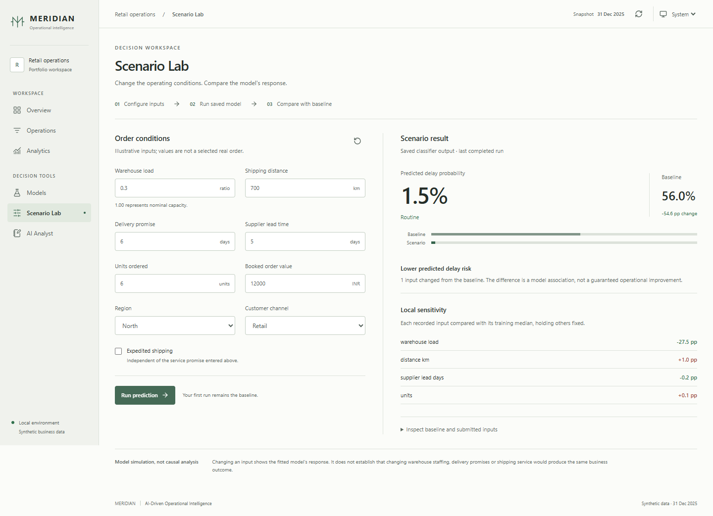
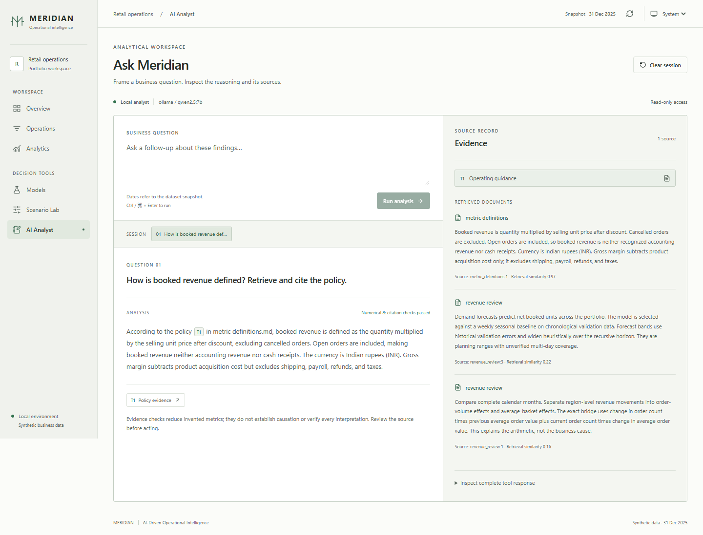
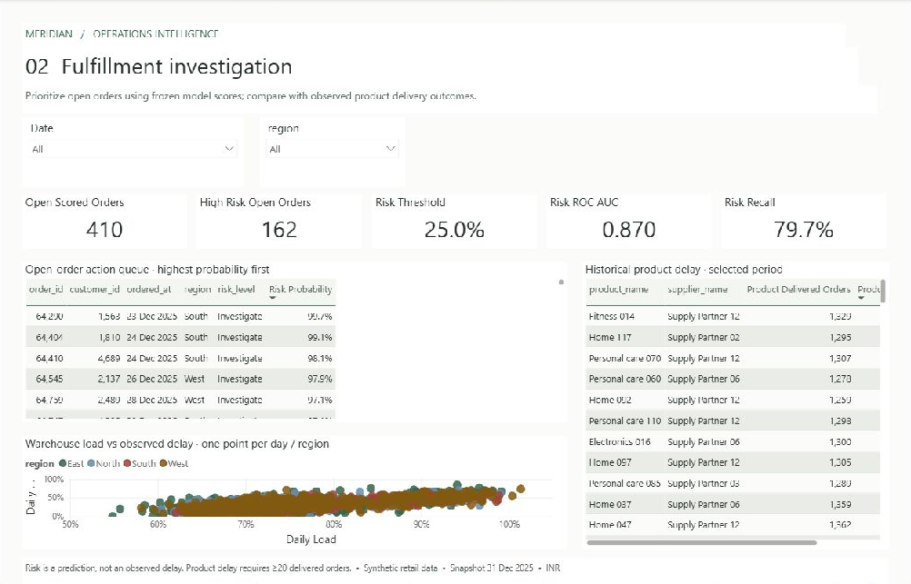
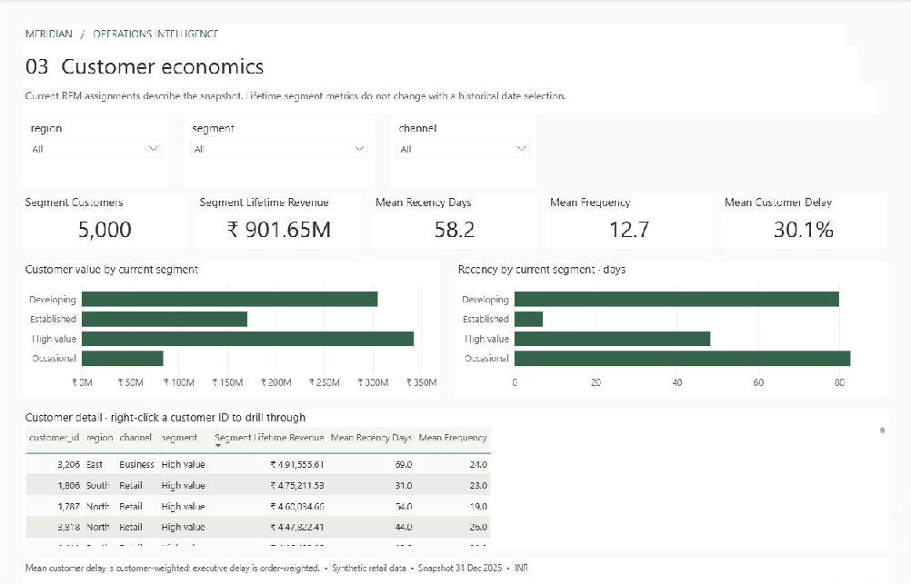
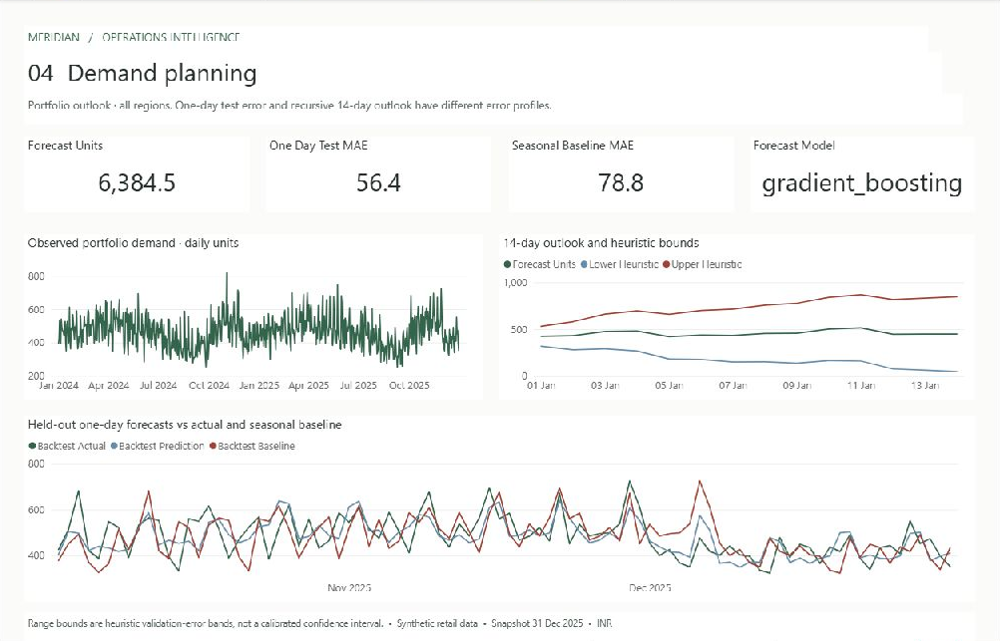
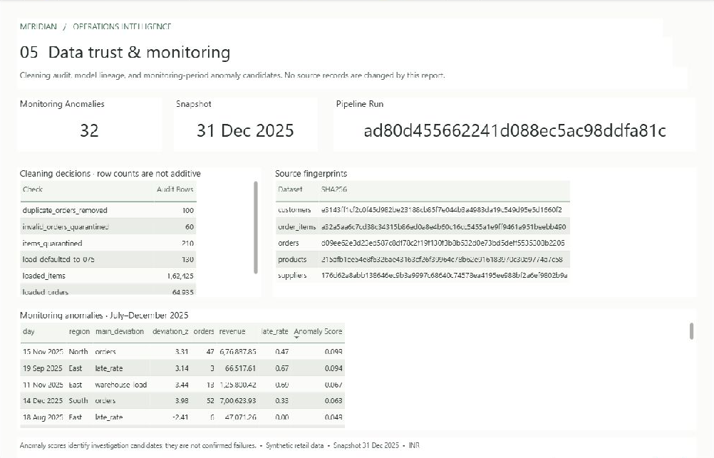
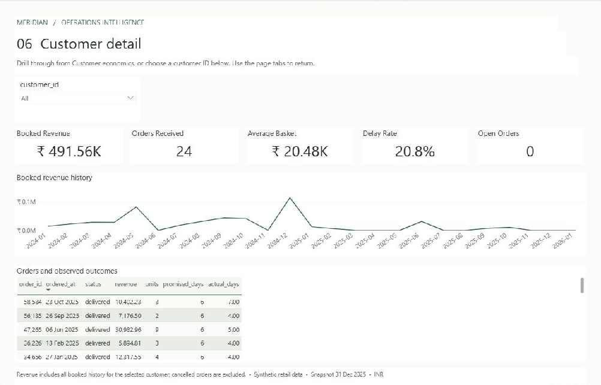

# Meridian — final screenshot gallery

Captured on **27 September 2026** from the running local application and the saved,
reopened Power BI report. All business data is synthetic. Images are actual application
captures; no dashboard values or visual content were composited.

## Web application

The overview uses the default **2–31 December 2025** reporting period. Power BI overview
below shows **all history**; align dates and regions before comparing their totals.

### Scenario comparison

Changing placement-time inputs calls the existing saved model. The comparison shows
model sensitivity, not a guaranteed intervention outcome.

### AI policy retrieval

The restarted local Ollama workflow used the real `search_policies` tool and returned a
cited explanation. Numerical answers may be withheld when evidence checks fail; the
actual structured tool results remain available. See [the handoff record](handoff.md).

## Power BI — six distinct pages

These captures use the **persisted Meridian theme after closing and reopening the PBIX**.
Application chrome was cropped, with no alteration to report content. Original full-window
captures are retained locally in `reports/powerbi/final/`. The [manifest](assets/powerbi/manifest.json)
records six different original hashes and six different cropped-image hashes. Each page's
heading and contents were visually reviewed; hash uniqueness alone is not treated as proof.

### 01 Executive overview

All-history commercial performance, delivery reliability and category contribution.

### 02 Fulfillment investigation

Actual saved open-order risk scores, model evaluation and observed fulfillment conditions.

### 03 Customer economics

Current RFM segments, customer value and the table used for customer drillthrough.

### 04 Demand planning

Observed units, the saved recursive forecast and held-out one-day backtest.

### 05 Data trust & monitoring

Cleaning decisions, source fingerprints and monitoring-period anomaly candidates.

### 06 Customer detail

Customer **3206**, reached by right-click drillthrough from Customer economics: 24 orders
and ₹491.56K booked revenue. The inherited drillthrough filter restricts this page even
though the additional local customer slicer displays `All`.

See [Power BI verification](power-bi-verification.md) for actual-engine reconciliation,
or follow the [five-minute demo](demo-walkthrough.md). No hosted demo or recorded video is included.
